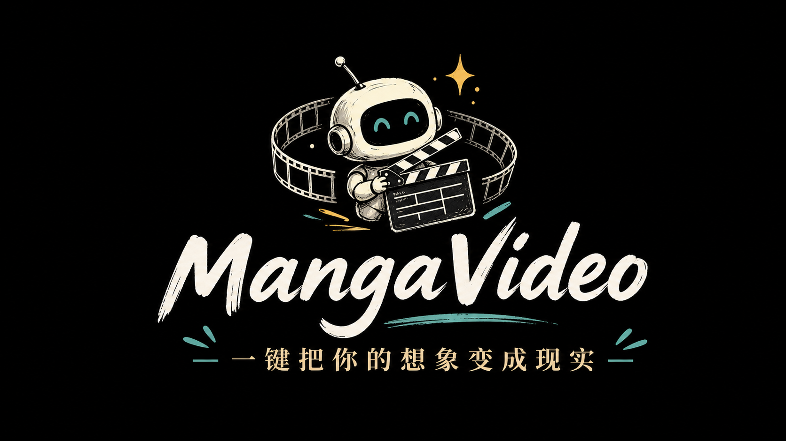
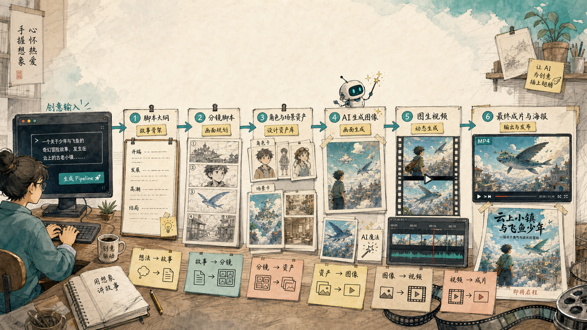

<p align="center">
  
</p>

<span align="center">

[**English**](./README.md) | [**项目文档**](./docs/) | [**提示词说明**](./prompts/README.md)

</span>

<p align="center">
    <a href="https://github.com/agentscope-ai/agentscope">
        
    </a>
    <a href="https://www.python.org/">
        
    </a>
    <a href="https://fastapi.tiangolo.com/">
        
    </a>
    <a href="https://react.dev/">
        
    </a>
    <a href="https://www.apache.org/licenses/LICENSE-2.0">
        
    </a>
</p>

## 什么是 MangaVideo？

MangaVideo 是一个基于 **AgentScope 2.0 多智能体框架**的 AI 短片自动生成流水线。你只需要输入一个创意主题，系统就会调度多个 AI Agent 协作——从剧本研究、分镜设计、视觉资产生成、视频合成到封面海报——全自动完成一部短片。

我们为创意工作者而设计。
我们的方法是让多个 AI Agent 像一支真正的制作团队一样协作，
而不是把各个环节割裂成独立的工具。

## 为什么选择 MangaVideo？

- **一键成片**：输入主题 → 选择风格 → 自动生成完整短片，6 个步骤全自动推进
- **多智能体协作**：创意总监、剧本研究员、分镜导演、美术生成师、视频生成师、质量审核员——7 个 Agent 各司其职
- **全流程质量把关**：每一步产出都有审核 Agent 打分评估，不通过自动返工
- **Web 控制台**：可视化进度链、产物预览、文本编辑、单步重跑、运行日志一应俱全
- **7 种风格预设**：电影短片、品牌广告、动画叙事、游戏 CG、MV、科幻短片、纪录片风格
- **Hook 全链路监控**：基于 AgentScope Middleware 的日志、进度、停止检查实时可见

<p align="center">
  
</p>

## 新闻

<!-- BEGIN NEWS -->
- **[2026-05] `发布`:** MangaVideo 基于 AgentScope 2.0 重构完成！多智能体协作体系全面落地，新增创意总监 Agent、全流程质量审核、封面生成功能。
- **[2026-05] `功能`:** Step3 图片提示词可视化编辑与单图重新生成功能上线。
- **[2026-05] `架构`:** 流水线核心迁移至 AgentScope Pipeline 编排器，支持 Hook 监控和智能编排。
<!-- END NEWS -->

## 社区

欢迎加入 AgentScope 社区，交流多智能体开发经验：

| [Discord](https://discord.gg/eYMpfnkG8h) | 钉钉 |
| --- | --- |
|  |  |

## 📑 Table of Contents

- [快速开始](#快速开始)
  - [安装](#安装)
    - [安装 AgentScope 2.0](#安装-agentscope-20)
    - [安装 Python 依赖](#安装-python-依赖)
    - [配置密钥](#配置密钥)
    - [安装前端依赖](#安装前端依赖)
- [Hello MangaVideo！](#hello-mangavideo)
  - [Web 控制台启动](#web-控制台启动)
  - [命令行一键运行](#命令行一键运行)
- [多智能体架构](#多智能体架构)
- [贡献](#贡献)
- [许可](#许可)

## 快速开始

### 安装

> MangaVideo 需要 **Python 3.11** 或更高版本，以及 **Node.js 18+** 和 **pnpm**。

#### 安装 AgentScope 2.0

```bash
pip install agentscope

# 或从源码安装
# git clone https://github.com/agentscope-ai/agentscope
# cd agentscope
# pip install -e .
```

#### 安装 Python 依赖

```bash
cd manga-pipeline
pip install -r requirements.txt
```

#### 配置密钥

```bash
cp .env.example .env
```

编辑 `.env` 文件：

```env
DEEPSEEK_API_KEY=你的 DeepSeek 密钥
ARK_API_KEY=你的火山引擎 Ark 密钥
```

- `DEEPSEEK_API_KEY`：用于剧本、分镜、提示词生成和审核
- `ARK_API_KEY`：用于 Seedream 文生图和 Seedance 图生视频

#### 安装前端依赖

```bash
cd web
pnpm install
cd ..
```

## Hello MangaVideo！

### Web 控制台启动

**终端 1 — 启动后端**

```bash
python -m uvicorn server.main:app --host 127.0.0.1 --port 8765
```

健康检查：`http://127.0.0.1:8765/api/health`

**终端 2 — 启动前端**

```bash
cd web
pnpm dev
```

浏览器打开 `http://localhost:5173`，输入主题、选择风格，点击「运行全部步骤」即可。

### 命令行一键运行

```bash
python pipeline.py "一个关于少年与飞鱼的奇幻冒险" --duration 90 --style 电影短片
```

生成产物保存在 `outputs/<项目ID>/`：

```text
outputs/<项目ID>/
├── director_guidance.json   # 创意总监指导
├── script_brief.json        # 剧本纲要
├── step_01_review.json      # 剧本审核结果
├── storyboard.json          # 分镜脚本
├── step_02_review.json      # 分镜审核结果
├── img_results.json         # 图片生成结果
├── step_03_review.json      # 图片审核结果
├── video_prompts.json       # 视频提示词
├── step_04_review.json      # 视频审核结果
├── images/                  # 角色/场景资产图
├── videos/                  # 视频片段
├── final.mp4                # 最终成片
└── images/cover.png         # 封面海报
```

## 多智能体架构

MangaVideo 使用 AgentScope 2.0 的 Agent + Middleware + Pipeline 体系，构建了一支 7 人 AI 制作团队：

```
🎬 创意总监 (DirectorAgent)    ← 分析需求，输出创意指导纲要
    │
    ▼
📝 剧本研究员 (ResearchAgent)   ← Step1 剧本生成 + 审核返工
    │
    ▼
🎥 分镜导演 (StoryboardAgent)   ← Step2 分镜拆解 + 审核
    │
    ▼
🎨 美术生成师 (ImageGenAgent)   ← Step3 角色/场景图片生成 + 审核
    │
    ▼
🎬 视频生成师 (VideoGenAgent)   ← Step4 图生视频 + 审核
    │
    ▼
✂️ 剪辑师 (ConcatAgent)        ← Step5 ffmpeg 拼接成片
    │
    ▼
🖼️ 封面设计师 (CoverAgent)     ← Step6 电影节海报封面生成
    │
🔍 质量审核员 (ReviewerAgent)   ← 全流程质量把关（Step2/3/4）
```

### 项目结构

```text
manga-pipeline/
├── web/                 # React + Vite + Tailwind CSS 前端控制台
├── server/              # FastAPI 后端 API 服务
├── agents/              # AgentScope Agent 封装（7 个 Agent + 编排器 + Middleware）
├── steps/               # 各步骤底层执行逻辑
├── prompts/             # 提示词模板（7 种风格 + 审核规则）
├── tests/               # 自动化测试
├── docs/                # 设计文档
└── outputs/             # 本地生成产物
```

## 贡献

我们欢迎社区的贡献！如果你有好的想法或发现 bug，欢迎提交 Issue 或 Pull Request。

## 许可

MangaVideo 基于 Apache License 2.0 发布。

基于 [AgentScope 2.0](https://github.com/agentscope-ai/agentscope)（Apache 2.0）构建。
